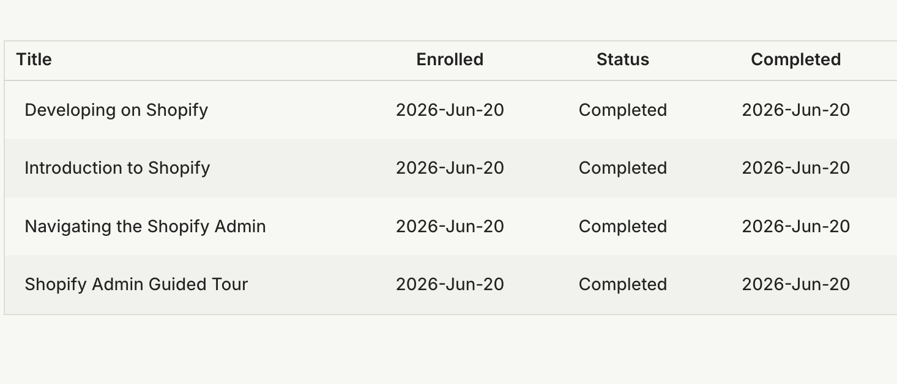
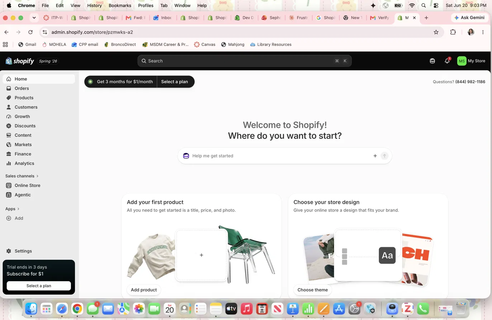

## Introduction

This report documents my completion of the introductory Shopify learning materials and my exploration of the Shopify admin area, as part of **Assignment 1** for ITP-W03. This assignment lays the groundwork for the larger individual Shopify Retail Store and GA4 Integration Project, and connects directly to the CPP Farm Store consulting project.

> "Shopify simplifies the technical side of e-commerce so that store owners can focus on products, customers, and growth." — *Personal takeaway from Shopify Academy*

## Evidence of Shopify Learning Completion

I completed the following Shopify Academy modules and the Admin Guided Tour:

- Introduction to Shopify (20 min)
- Navigating the Shopify Admin (20 min)
- Developing on Shopify (60 min)
- Shopify Admin Guided Tour

::: callout-note
## Completion Evidence

The table below, exported from my Shopify Academy account, confirms all four required modules were enrolled in and completed on the same day.

:::

## Shopify Admin Exploration

After completing the learning materials, I logged into a Shopify practice account and explored the admin dashboard.

::: callout-tip
## Admin Screenshot

The screenshot below shows the Shopify admin dashboard for my development store, including the left-hand navigation with Home, Orders, Products, Customers, Growth, Discounts, Content, Markets, Finance, and Analytics.

:::

## Feature Reflection {#sec-features}

Below are five Shopify features that are important for online retailing, organized in a tabbed panel for easier reading.

::: panel-tabset
## Products

The Products section is where store owners add, organize, and manage everything they sell — including titles, descriptions, images, variants (size, color, etc.), pricing, and inventory counts. It's the foundation of the entire store, since every other feature (collections, orders, marketing) connects back to product data.

## Collections

Collections group related products together (e.g., "Summer Produce" or "Dairy Items") so customers can browse more easily. Collections can be built manually or automatically based on rules like tags or product type, which makes merchandising and navigation much faster to manage as a catalog grows[^1].

## Orders

The Orders dashboard tracks every transaction from checkout through fulfillment and delivery. It shows payment status, shipping status, and customer details in one place, which helps store owners manage day-to-day operations without needing separate tools.

## Customers

The Customers section stores contact information, order history, and purchase behavior for everyone who has bought from (or signed up with) the store. This data is useful for repeat marketing, loyalty programs, and understanding who the store's actual buyers are.

## Analytics

Shopify's built-in Analytics (and its integration with tools like Google Analytics 4) gives store owners visibility into traffic, conversion rates, and sales trends. This is critical for making informed decisions about marketing spend, inventory, and which products to promote.
:::

[^1]: Automated collections update themselves automatically as new products matching the rule are added, reducing manual upkeep.

See @sec-cppfarm for how these features could apply to a real local business.

## CPP Farm Store Application Reflection {#sec-cppfarm}

Shopify could meaningfully support CPP Farm Store by giving it a low-cost, easy-to-manage online storefront without requiring in-house web development expertise. Using Products and Collections, the Farm Store could organize seasonal produce, eggs, and other goods into clear categories for customers to browse online. The Orders and Customers features would let staff track local pickup or delivery orders and build a repeat-customer base, while Shopify's Analytics (paired with GA4) could reveal which products and marketing efforts are actually driving traffic and sales. Combined with Shopify's marketing and discount tools, the Farm Store could run seasonal promotions or loyalty incentives to encourage repeat visits — all from a single, manageable platform suited to a small local retail operation.

## Appendix {.appendix}

- **GitHub Repository:** [Insert clickable URL here](#)
- **GitHub Pages (Published Site):** [Insert clickable URL here](#)

::: callout-important
## Reminder

Replace the placeholder links above with your actual GitHub repo and GitHub Pages URLs before submitting.
:::
Add Assignment 1 files
